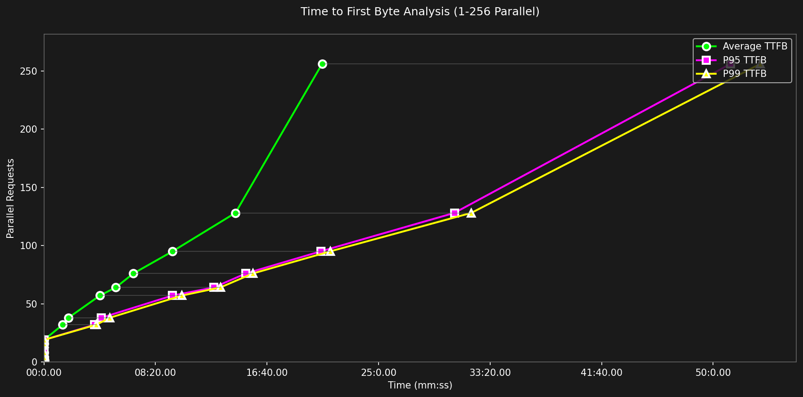
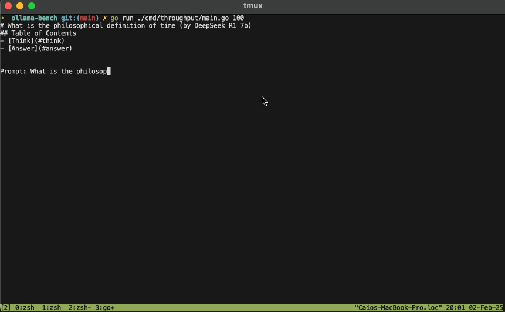
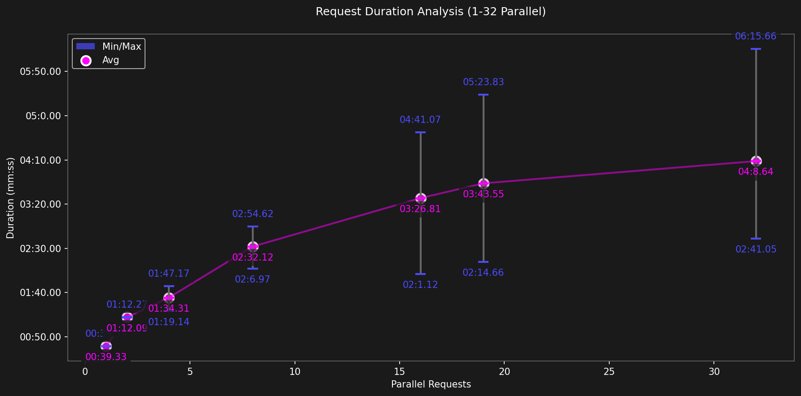
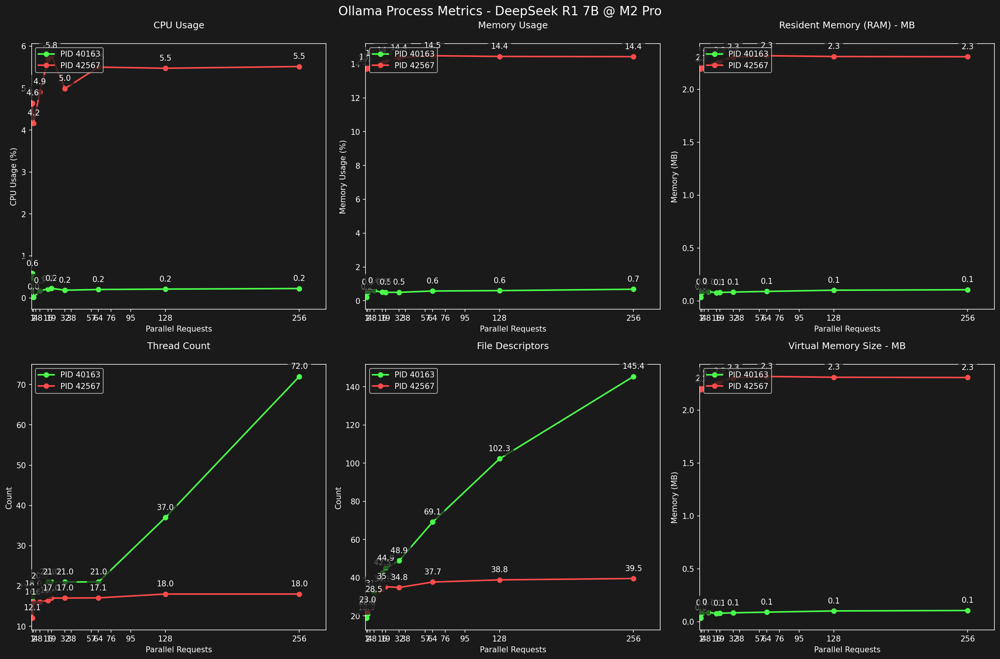

# Benchmarking DeepSeek R1 7B on M2 Pro


- [Introduction](#introduction)
  - [What's the point?](#whats-the-point)
- [The Prompt](#the-prompt)
  - [What is Time?](#what-is-time)
- [The Answer](#the-answer)
- [How were the metrics gathered?](#how-were-the-metrics-gathered)
  - [Sequence Diagram](#sequence-diagram)
  - [Process Monitor](#process-monitor)
  - [GPU Monitor](#gpu-monitor)
  - [Requests Metrics](#requests-metrics)
  - [Hardware Specification](#hardware-specification)
  - [Tools](#tools)
    - [Ollama](#ollama)
    - [Golang](#golang)
    - [Python](#python)
- [Benchmark Results](#benchmark-results)
  - [Waiting Time (TTFB)](#waiting-time-ttfb)
    - [TTFB Table Data](#ttfb-table-data)
  - [Velocity](#velocity)
    - [Comparing different token/s speed](#comparing-different-tokens-s-speed)
      - [55 tokens per second](#55-tokens-per-second)
      - [30.7 tokens per second](#307-tokens-per-second)
      - [9.1 tokens per second](#91-tokens-per-second)
      - [100 tokens/s](#100-tokens-s)
  - [Acceptable Thresholds](#acceptable-thresholds)
    - [Maximum Acceptable Wait Time](#maximum-acceptable-wait-time)
    - [Minimum Acceptable Response Speed](#minimum-acceptable-response-speed)
  - [Throughput + Wait Time](#throughput--wait-time)
    - [Throughput + Wait Time Table Data](#throughput--wait-time-table-data)
  - [Duration](#duration)
    - [Requests Average Duration](#requests-average-duration)
    - [Table Data](#table-data)
  - [Combined Metrics (Tokens/s x Duration x Wait Time)](#combined-metrics-tokens-s-x-duration-x-wait-time)
  - [GPU Usage](#gpu-usage)
  - [RAM/CPU/Threads Usage](#ramcputhreads-usage)
    - [Web Server Process](#web-server-process)
      - [Table Data](#table-data-1)
    - [DeepSeek Process](#deepseek-process)
      - [Table Data](#table-data-2)
- [Summarized Results](#summarized-results)
  - [How many tokens/s can I get running DeepSeek R1 Gwen 7B locally with ollama?](#how-many-tokens-s-can-i-get-running-deepseek-r1-gwen-7b-locally-with-ollama)
  - [How many parallel requests can I serve with reasonable throughput?](#how-many-parallel-requests-can-i-serve-with-reasonable-throughput)
  - [What is a reasonable throughput?](#what-is-a-reasonable-throughput)
  - [How does the number of concurrent requests impact the performance?](#how-does-the-number-of-concurrent-requests-impact-the-performance)
- [Conclusion](#conclusion)


## Introduction
Hey there,

With the new hype of AI (Jan 2025) over DeepSeek's high-quality open-source models, an urge to explore self-hosted LLM models infected my mind. 

Therefore, I decided to build a _stress test_ benchmarking tool with Go (Channels 💙), fire it against Ollama & DeepSeek, monitor a bunch of metrics, and share the results with you.

This post analyzes the throughput capacity of [DeepSeek-R1-Distill-Qwen-7B](https://huggingface.co/Qwen/Qwen2.5-Math-7B) model running on [Ollama](https://ollama.com), at my personal dev MacBook and M2 Pro with 16GB Ram and a 19-Core GPU.


### What's the point?
I wanted to see how many parallel requests my M2 could handle at a decent _velocity_ and experiment with Go + Cursor + Claude Sonnet 3.5. 

It was a great experience and although the majority of the **code** was written by AI, none of the docs (or this text) was. 

You can expect this experiment to answer the following questions:
- How many tokens/s can I get running DeepSeek R1 Gwen 7B locally with [ollama](https://ollama.com)?
- How many parallel requests can I serve with reasonable throughput? 
   - What is a reasonable throughput?
- How does the number of concurrent requests impact the throughput?
- How much power did my GPU used while running this study?

Now let's talk about the test.

## The Prompt
Inspired by a recent book I've read (_A Universe From Nothing_), I selected the following question as the prompt for each request:

> What is the philosophical definition of time?

Which is a very profound question that requires some reasoning. It is useful to analyze the _Chain of Thought_ process of DeepSeek R1, as it is a core feature of the model to return the answer in 2-steps: 

`\<think>{THINK}\</think>` and `{RESPONSE}`.

### What is Time?
Time have _abstract (the final end, the first beggining)_ and _structured (seconds, minutes, hours)_  definitions.

It can be used to express a relation between unrelated events, to represent something we feel (the passage of time) when we access our memories and to wonder about the big misteries of the universe: Where do we came from? Where are we going?


> I am the _beginning_, the _end_ and _the middle_.
> — Raul Seixas 

The selected structured representation of time was _min:seconds_ and we'll analyze _Waiting Time_ and _Duration Time_.

## The Answer
[Here](./what-is-the-philosophical-definition-of-time.md) you can see one of the responses generated by the 7B model during one of the tests.

My opinion (as a Software Engineer, not a philosopher nor a physicist) is that is pretty good.

It's marvelous to read the _\<think>_ section and observe how the model groups multiple subjects related to the question before providing a final answer.

I'm not a Data Science expert, so I can't explain the under-the-hood workings, but it **appears** to reuse this first exploration prompt to re-prompt the model.

This is revolutionary, as it's the first time I've seen this two-step answer strategy built inside the model.

The strategy itself isn't necessarily new, as I've manually used it before with a Custom GPT called [Prompt Optimizer](./https://chatgpt.com/g/g-4uKamI8cT-prompt-optimizer), a kind of pre-prompting to get better final prompts, it is specially hepful when generating images from text.

Anyway, this is pretty cool! 

The difference in quality between DeepSeek R1 (full model) and ChatGPT for small prompts is noticeable. 

This automatic _context-universe-expansion_ also eliminates the growing need to be good at _Prompt Engineering_. It now comes for free, inside the model.

So, returning to the test 😁

If you don't care about how the data was collected, you can [time-travel](#benchmark-results) to the Benchmark Results to see some nice charts.

## How were the metrics gathered?
The idea was to execute multiple rounds of parallel HTTP requests to the Ollama Web Server endpoint (1, 2, 4, 8, 16, 19, 32, 38, 57, 64,76, 95, 128 and 256).

Since my GPU has 19 cores, I selected **19** as one of the rounds (and a few other multiples) to ensure each GPU Core is busy.


### Sequence Diagram
The test goes in cycles, each cycle containing a different set of concurrent requests. 

Each cycle waits 10s after finished to start the next one.


### Process Monitor
It uses `pgrep ollama` to find all PIDs involved in running the model requests and will monitor, store and display:

- Thread Count
- File Descriptors
- RAM Usage
- CPU Usage

### GPU Monitor
It uses the awesome tool [powermetrics](https://www.unix.com/man-page/osx/1/powermetrics/) to calculate:

- Power (W)
- Frequency (MHz)
- Usage (%)

Over 1s intervals.

### Requests Metrics
For each request of the cycle, it was analyzed the following properties:

- Throughput (Tokens/s)
- TTFB (Time To First Byte)
- WaitingTime 
- TokenCount
- ResponseDuration
- TotalDuration

### Hardware Specification
| Component | Specification |
| --------- | ------------ |
| Device | MacBook Pro 16-inch (M2, 2023) |
| CPU | 12-core AMD Processor |
| Memory | 16GB RAM |
| GPU | Integrated M2 Series GPU (19 Cores) |
| OS | macOS Sonoma |

### Tools
#### Ollama
A local LLM inference framework CLI that's very easy to use.

For this benchmark, the selected model was `deepseek-r1:7b` but it could've been any other, as `ollama` makes it ridiculously simple to run LLMs locally.

#### Golang 
The chosen programming language, used to create the benchmarking client and monitoring tools.

Why? Well, Go is an outstanding tool for parallel computing. 

I'm a JS developer (not a Golang expert yet) but I can recognize a great parallel/concurrent tool when I see one. 

Go Scheduler is indeed awesome.

#### Python 
Nothing better to analyze bunch of csv and generate beautiful charts.

For instructions on how to run this benchmark, please check [how-to-run.md](./how-to-run.md).

## Benchmark Results
As we are using HTTP requests as the traffic method of this experiment, I decided to use [Time To First Byte](./https://web.dev/articles/ttfb?hl=pt-br) to represent the _Waiting Time_.

### Waiting Time (TTFB)
The **waiting time (TTFB)** is the delay between hitting the **Enter** key and seeing the first character on your screen.

Since in this experiment the `client` and the `server` are on the same network, hardware and computer, we are actually calculating the time it takes for the **Golang** process to communicate with the **Ollama** process, that will be running the **DeepSeek R1** model, that will generate the responses and stream it back to **Golang** process.
With that said, let's contemplate some colored charts:


Ok, looks interesting, it shows that somewhere near 25 parallel requests the Wait Time spikes aggressively and continues to grow at a stable rate, reaching an unbelievable 50 minutes on p99 for 256 requests/s.

Let's zoom in:


We can see that from cycle 1-19, the TTFB is close to 0, ranging its average from `0.62s` to `0.83s`, that's pretty much _instant_ for human perception.

It makes sense if you take the available amount of GPU cores into consideration, which you should, otherwise the `OLLAMA_MAX_PARALLEL` flag will have it's default value (**4
**), and your results will be poisoned (trust me, I've been there). 

#### TTFB Table Data
<details>
<summary>TTFB Table Data (only if you care)</summary>

| Parallel | Avg      | P95       | P99       |
|----------|----------|-----------|-----------|
| 1        | 0.83     | 0.93      | 0.93      |
| 2        | 0.36     | 0.44      | 0.44      |
| 4        | 0.38     | 0.42      | 0.42      |
| 8        | 0.47     | 0.51      | 0.51      |
| 16       | 0.64     | 0.67      | 0.67      |
| 19       | 0.62     | 0.64      | 0.64      |
| 32       | 84.05    | 227.13    | 234.90    |
| 64       | 321.96   | 761.89    | 790.82    |
| 128      | 858.27   | 1839.99   | 1915.72   |
| 256      | 1247.02  | 3078.62   | 3211.85   |

</details>


### Velocity
This is the most important metric of the experiment.

The following chart shows that by running DeepSeek R1 Gwen 7b, self-hosted with Ollama on a MacBook Pro M2 with 16GB RAM and 19 GPU cores, we can achieve a maximum of **55 tokens/s** when making a single request.


When utilizing the full potential of the GPU with **19** parallel requests though, the average throughput dropped to mere **9.1 tokens/s**.

It kept dropping until the lowest value at **256** requests with **6.3** tokens/s.

#### Comparing different token/s speed
It's hard to mentally visualize what 55, 9.1 or 6.3 tokens/s actually means, so I recorded a couple of GIFs to help:

##### 55 tokens per second 


##### 30.7 tokens per second 


##### 9.1 tokens per second


For me, the ideal speed of a **fast** application would be around 100 tokens/s, and the slow-but-usable floor limit would be around 20 tokens/s. I mean, faster speed is never enough. It's like internet download/upload or video FPS (Frames Per Second) when rendering games, the higher the better.

##### 100 tokens/s


### Acceptable Thresholds
What should be the acceptable thresholds for an usable real-world application using the DeepSeek + Ollama? 

How much time does an average user waits on a loading application before it quits?

What is the slowest acceptable speed to read a text without getting bored?

#### Maximum Acceptable Wait Time 
I'll choose **10s** as an arbitrary value for maximum acceptable wait time.

In reality, users are more impatient and the value may be much lower.

Looking at the [TTFB table data](#ttfb-table-data), 19 is the last cycle that meets our 10s threshold with a 0.62s wait. At 32 parallel requests, the average Waiting Time jumps to 1 min and 25 seconds.

Unless you're using DeepSeek for background tasks with no human interaction, a wait time of 1m25s is _unacceptable_. Based on the 10s threshold, the maximum parallel requests for a usable app should be **19**.

#### Minimum Acceptable Response Speed 
I believe it should be ~19.9 tokens/s.


This metric is totally arbitrary and personally chosen based on how I felt watching the [speed gifs](./#comparing-different-tokens/s-speed).

Anything less than 20 tokens/s feels slightly annoying. 

With this new limit, the maximum parallel requests considering acceptable response time is **4**.

Ok, let's take a look at the combined metrics now.

### Throughput + Wait Time
Speed is good, but in 2025, Time To First Byte must be minimal in order for a product to be usable.

No one likes to click a button and wait 20 seconds or 2 minutes for something to happen.


#### Throughput + Wait Time Table Data
<details>
<summary>Throughput + Wait Time Table Data</summary>

| Parallel | Avg t/s | P95 t/s | P99 t/s | Wait(s) | Errors% | Duration | P99 Duration |
|----------|---------|---------|---------|---------|---------|----------|--------------|
| 1.0      | 53.1    | 53.1    | 53.1    | 0.94    | 0.0     | 00:39.33 | 00:39.33     |
| 2.0      | 30.7    | 30.9    | 30.9    | 0.36    | 0.0     | 01:12.09 | 01:12.27     |
| 4.0      | 19.9    | 20.4    | 20.5    | 1.54    | 0.0     | 01:34.31 | 01:47.17     |
| 5.0      | 19.2    | 20.6    | 20.7    | 0.30    | 0.0     | 01:39.01 | 01:59.26     |
| 8.0      | 12.9    | 13.5    | 13.7    | 0.47    | 0.0     | 02:32.12 | 02:54.62     |
| 16.0     | 9.8     | 10.1    | 10.3    | 0.64    | 0.0     | 03:26.81 | 04:41.07     |
| 19.0     | 9.1     | 9.5     | 9.6     | 0.62    | 0.0     | 03:43.55 | 05:23.83     |
| 32.0     | 8.0     | 9.3     | 9.3     | 84.05   | 0.0     | 04:08.64 | 06:15.66     |
| 64.0     | 7.1     | 9.0     | 9.3     | 321.96  | 0.0     | 04:39.51 | 07:30.13     |
| 128.0    | 6.5     | 8.9     | 9.2     | 858.27  | 0.0     | 05:06.60 | 07:28.05     |
| 256.0    | 6.3     | 8.8     | 9.4     | 1534.79 | 0.0     | 04:12.89 | 07:52.97     |
</details>

### Duration
The first cycle lasted less than a minute (39 seconds) while the last cycle took 8 min and 51 seconds to complete.


#### Requests Average Duration


For the initial cycles, the average duration of each request grows slowly but noticeably. While the single request took only 39s to complete, requests that used all available cores (cycle 19) took, on average, 03 minutes and 43 seconds to complete.

<details>
<summary>Table Data</summary>

| Parallel | Min      | Avg      | P99      | Max      |
|----------|----------|----------|----------|----------|
| 1        | 00:39.33 | 00:39.33 | 00:39.33 | 00:39.33 |
| 2        | 01:11.92 | 01:12.09 | 01:12.27 | 01:12.27 |
| 4        | 01:19.14 | 01:34.31 | 01:47.17 | 01:47.17 |
| 5        | 01:24.99 | 01:39.01 | 01:59.26 | 01:59.26 |
| 8        | 02:06.97 | 02:32.12 | 02:54.62 | 02:54.62 |
| 16       | 02:01.12 | 03:26.81 | 04:41.07 | 04:41.07 |
| 19       | 02:14.66 | 03:43.55 | 05:23.83 | 05:23.83 |
| 32       | 02:41.05 | 04:08.64 | 06:15.66 | 06:15.66 |
| 64       | 02:17.05 | 04:39.51 | 07:30.13 | 07:30.13 |
| 128      | 02:35.36 | 05:06.60 | 07:28.05 | 08:38.04 |
| 256      | 00:00.00 | 04:12.89 | 07:52.97 | 08:51.75 |
</details>

### Combined Metrics (Tokens/s x Duration x Wait Time)


Wait time grows linearly after 19 parallel requests, making it unusable for interactive applications. 

It also shows that throughput drops exponentially before stabilizing at much lower cycles.

Let's zoom in into smaller cicles:


Here, the chart is different: the wait time is stable at <1s until cycle 19 and it's clear to see the connection between throughput and p99 request duration.

### GPU Usage
Thanks to powermetrics, it's possible to get GPU usage metrics in MacOS!

The Macbook M2 19-GPU proved to be pretty constant, with small variations in the GPU Frequency, stable at 1397MHz, and Power Usage, stable at ~20.3W.

The concurrency level didn't seem to affect the GPU metrics.


```
sudo powermetrics --samplers gpu_power -n1 -i1000
```

### RAM/CPU/Threads Usage
To analyze how much computer resource the Ollama + DeepSeek was consuming, I tracked the ollama processes (with pgrep, lsof and ps) and monitored the following metrics:

- CPU Usage (%)
- Memory Usage (%)
- Resident Memory (MB)
- Thread Count (int)
- File Descriptors (int)
- Virtual Memory Size (MB)

Ok, when you have _ollama serve_ running idle, it uses a single process.

When there is 1 or 256 active requests, ollama uses 2 processes.



By analyzing the chart, we can see that they behave different from each other.

While one of them has high memory/cpu usage and low thread count/open file descriptors, the other one has the opposite: low cpu/memory usage with linear growing open FDs and high thread count.

If I had to guess, I would say that the green process may be responsible for the Web Server while the red one for the DeepSeek R1 LLM generations.

#### Web Server Process
While the open File Descriptors grow linearly as the number of concurrent requests grows, the Thread count has a steeper pattern upward.

Notably, the CPU and memory usage of this process remain constantly low, between 0.2~0.6% for CPU and 82.6 -> 114.1MB for RAM.

<details>
<summary>Table Data</summary>
| Concurrency | Avg CPU% | Max CPU% | Avg Mem% | Max Mem% | Avg Threads | Avg FDs | Avg RAM(MB) | Max RAM(MB) |
|-------------|----------|----------|----------|----------|-------------|----------|-------------|-------------|
| 1           | 0.6      | 22.8     | 0.2      | 0.5      | 17.0        | 18.9     | 36.4        | 82.6        |
| 2           | 0.0      | 0.8      | 0.5      | 0.5      | 18.0        | 21.0     | 83.4        | 83.6        |
| 8           | 0.2      | 1.7      | 0.6      | 0.6      | 20.0        | 31.7     | 90.4        | 90.9        |
| 16          | 0.2      | 1.5      | 0.5      | 0.6      | 21.0        | 42.5     | 79.4        | 95.2        |
| 19          | 0.2      | 2.2      | 0.5      | 0.5      | 21.0        | 44.9     | 82.0        | 82.6        |
| 32          | 0.2      | 2.2      | 0.5      | 0.5      | 21.0        | 48.9     | 85.6        | 86.2        |
| 64          | 0.2      | 2.9      | 0.6      | 0.6      | 21.0        | 69.1     | 92.1        | 94.6        |
| 128         | 0.2      | 2.7      | 0.6      | 0.7      | 37.0        | 102.3    | 103.8       | 108.4       |
| 256         | 0.2      | 4.2      | 0.7      | 0.7      | 72.0        | 145.4    | 108.2       | 114.1       |

</details>

#### DeepSeek Process
If the Open FDs and Threads Count snitched the Web Server process, the Memory Consumption and maximum Threads Count of 18 snitched the DeepSeek Process.

The fact that the number of threads doesn't outgrow the number of GPU Cores, even when under higher concurrency cycle, indicates that this process might be the one in charge of DeepSeek, that uses the GPU, that has 19 cores. 

The average RAM Usage of this process is remarkable: from 2.2 to *2.3GB*, representing 13.7 to 14.6% of all available RAM, CPU usage is also high for a process, consuming 5.7% for a single request and 13.1% for 256.

<details>
<summary>Table Data</summary>
| Concurrency | Avg CPU% | Max CPU% | Avg Mem% | Max Mem% | Avg Threads | Avg FDs | Avg RAM(MB) | Max RAM(MB) |
|-------------|----------|----------|----------|----------|-------------|----------|-------------|-------------|
| 1           | 4.6      | 5.7      | 13.7     | 13.7     | 12.1        | 22.0     | 2248.1      | 2250.6      |
| 2           | 4.2      | 5.2      | 13.8     | 13.8     | 16.0        | 23.0     | 2259.9      | 2263.1      |
| 8           | 4.9      | 7.9      | 14.0     | 14.1     | 16.0        | 28.5     | 2299.6      | 2303.3      |
| 16          | 5.7      | 11.6     | 14.0     | 14.3     | 16.4        | 34.1     | 2299.1      | 2335.5      |
| 19          | 5.8      | 14.3     | 14.2     | 14.2     | 17.0        | 35.3     | 2327.4      | 2330.6      |
| 32          | 5.0      | 12.0     | 14.4     | 14.4     | 17.0        | 34.8     | 2359.1      | 2366.3      |
| 64          | 5.5      | 14.2     | 14.5     | 14.6     | 17.1        | 37.7     | 2374.2      | 2390.0      |
| 128         | 5.5      | 13.2     | 14.4     | 14.6     | 18.0        | 38.8     | 2366.5      | 2397.7      |
| 256         | 5.5      | 13.1     | 14.4     | 14.6     | 18.0        | 39.5     | 2364.1      | 2385.5      |

</details>

## Summarized Results
These results were generated running Ollama + DeepSeek on a Macbook M2 Pro, 16GB of RAM and 19-Core GPU, it will probably be different in a different setup.

### How many tokens/s can I get running DeepSeek R1 Gwen 7B locally with [ollama](https://ollama.com)?
For a single request: 53.1 tokens/s.

For 19 paralllel requests -> 9.1 tokens/s.

For 256 concurrent requests -> 6.3 tokens/s. 

You can check the [Table Data](#throughput--wait-time-table-data) if you want.

### How many parallel requests can I serve with reasonable throughput? 
Assuming 19.9 tokens/s as a reasonable throughput, this machine can serve up to 4 requests in parallel.

This may be enough for single-person daily routine tasks but is definitely not enough to run a commercial API server.

### What is a reasonable throughput?
During the course of writting this article, I created a CLI to showcase different token/s speeds, you can check it out [here](#comparing-different-tokens-speed).

### How does the number of concurrent requests impact the performance?
A lot! 

For more than 19 concurrent requests, the wait time becomes unbearable, and for more than 5 parallel requests, the response speed is too low.


[Table Data](#throughput--wait-time-table-data)

## Conclusion
Considering this is the 7b version model, and it can reach up to 55 tokens/s when serving a single request, I would say it is fast and good enough to chat interactively during daily tasks, with a reasonably low power usage (same as a led lamp).

I mean, the quality is far from great when compared to 671b version (which is the model that beats OpenAI models), but I believe this is just the beginning. 

Quantization strategies will become more effective, and soon we'll be able to cherry-pick subjects to train smaller models, which we demonstrated to be possible to run on a _developer's_ computer. It is **possible**, we're in the Tech Industry.

It happened with the processor, the disk and the memory, it's a matter of time until it happens with AI inference chips and LLM models.

## Contributing
Feel free to use the code in any way you like it.

Take a look at [How to Run](./how-to-run.md)