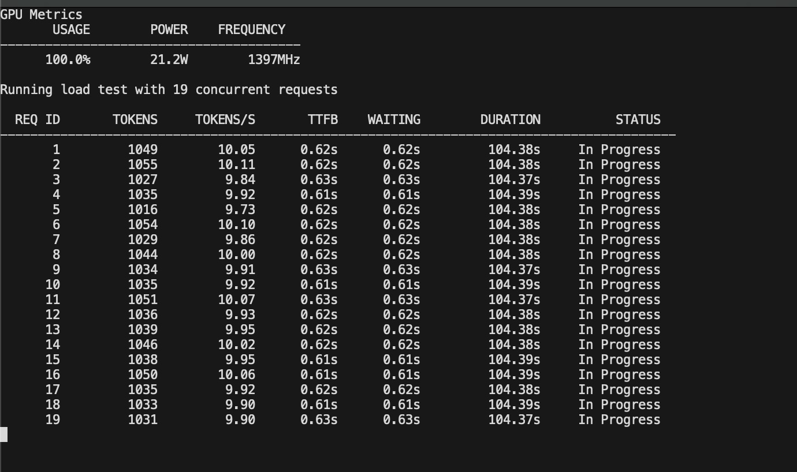

# Running DeepSeek R1 Benchmark


## Requirements
- Go v1.23.4
- Python 3.13
- Macbook M-Series GPU (powermetrics)
- Ollama 

## Start Ollama 
By default, Ollama restricts parallel requests based on available memory. To maximize throughput, set **OLLAMA_NUM_PARALLEL** variable to the number of cores in your GPU.

<details>
<summary>Fun fact</summary>
Fun fact: Initially, I didn't know about this config and noticed 8 out of 12 requests stopped during the 12 parallel-requests cycle. I moved it to 12, thinking the CPU's 12 cores were the limit. Later, I realized the CPU usage was low and discovered my notebook's GPU is an M2 Series 19-Core GPU.

After running tests multiple times with solid results, I finally set OLLAMA_NUM_PARALLEL=19 for optimal performance.

Which is what you're gonna analyze, the results when running at maximum possible parallel power 🤓
</details>

### How many GPU Cores do you have?
First, check how many GPU cores your Mac has by running:
```bash
gpu_cores=$(system_profiler SPDisplaysDataType | grep 'Number of Cores' | awk '{print $NF}'); echo "GPU Cores: $gpu_cores"
```

You should see something like: 

```bash
GPU Cores: 19
```

Use this information to set the OLLAMA_NUM_PARALLEL flag of ollama.
```bash
OLLAMA_NUM_PARALLEL=19 ollama serve
```

## Model Warmup
On a new shell, please run the following:
```bash
ollama run deepseek-r1:7b
```

Make a small question like: "Why is the universe accelerating?" so you download and wake the model before the load.

## Run benchmark.go
On another terminal, run:

```
sudo ls
```

> **Note:** Superuser access is required because powermetrics (used for GPU metrics collection) needs root privileges. Without sudo, GPU metrics won't be collected.

Then,
```
go run ./cmd/benchmark/benchmark.go 19
```

You should see something like this:


Instead of only `19`, you can pass multiple values to this script, the main one used to generate this study was:
```
go run ./cmd/benchmark/benchmark.go 1,2,4,8,16,19,32,64,128,256
```

It may take a long time to finish, but once it does, you should see these files:

```
ollama/deepseek-r1-7b/
├── test_results_1/
│   ├── duration_metrics.csv     # Request duration statistics
│   ├── gpu_metrics.csv          # GPU usage, power, frequency
│   ├── process_1234_metrics.csv # Ollama server process
│   ├── process_1235_metrics.csv # Other ollama processes
│   └── request_summary.csv      # Per-request metrics summary
├── test_results_2/
│   └── ...
├── test_results_4/
│   └── ...
└── test_results_256/
    └── ...                      # Same structure for each concurrency level
```

## Run python analyze.py

### Start the Python Environment
Run:

```bash
python -m venv myenv && source venv /bin/activate
```

### Install dependencies
```bash
pip install -r requirements.txt
```

### Run the analyze script
Add the models that you collected data and are a folder at `ollama/{model}`

```bash
python analyze.py deepseek-r1-1b deepseek-r1-7b deepseek-r1-14b
```

This will generate the following archives
```
data/
├── duration_metrics_32.png
├── duration_metrics_256.png
├── gpu_metrics.png
├── performance_metrics.png
├── process_metrics.png
├── request_evolution.png
├── token_distribution.png
├── throughput_vs_avg.png
└── throughput_vs_p99_wait.png
```


## Console Output Example
| GPU Metrics | USAGE | POWER | FREQUENCY |
|-------------|-------|-------|-----------|
|             | 100.0%| 21.2W | 1396MHz   |

Running load test with 24 concurrent requests

| REQ ID | TOKENS | TOKENS/S | TTFB | WAITING | DURATION | STATUS       |
|--------|--------|----------|------|---------|----------|--------------|
| 1      | 0      | 0.00     | -    | 7.00s   | -        | Waiting      |
| 2      | 52     | 12.02    | 2.57s| 2.57s   | 4.43s    | In Progress  |
| 3      | 0      | 0.00     | -    | 7.00s   | -        | Waiting      |
| 4      | 53     | 12.27    | 2.56s| 2.56s   | 4.44s    | In Progress  |
| 5      | 0      | 0.00     | -    | 7.00s   | -        | Waiting      |
| 6      | 0      | 0.00     | -    | 7.00s   | -        | Waiting      |
| 7      | 0      | 0.00     | -    | 7.00s   | -        | Waiting      |
| 8      | 0      | 0.00     | -    | 7.00s   | -        | Waiting      |
| 9      | 0      | 0.00     | -    | 7.00s   | -        | Waiting      |
| 10     | 40     | 12.19    | 3.61s| 3.61s   | 3.40s    | In Progress  |

## CSV File Output Examples
**ollama/deepseek-r1-7b/test_results_24/request_7_throughput.csv**
| Timestamp              | TokenCount | Throughput |
|------------------------|------------|------------|
| 2025-01-30T17:11:09-03:00 | 1          | 4784689.00 |
| 2025-01-30T17:11:09-03:00 | 2          | 10.25      |
| 2025-01-30T17:11:09-03:00 | 3          | 7.61       |
| 2025-01-30T17:11:09-03:00 | 4          | 6.75       |
| 2025-01-30T17:11:10-03:00 | 6          | 7.55       |

**ollama/deepseek-r1-7b/test_results_24/request_summary.csv**
| RequestID | TTFB  | TotalDuration | ResponseDuration | WaitingTime | TokenCount | StatusCode | Status    |
|-----------|-------|---------------|------------------|-------------|------------|------------|-----------|
| 4         | 2.564 | 110.609       | 110.609          | 2.564       | 1183       | 200        | Completed |
| 14        | 2.567 | 140.983       | 140.983          | 2.567       | 1477       | 200        | Completed |
| 15        | 2.861 | 149.495       | 149.495          | 2.861       | 1527       | 200        | Completed |

## Images Output
You can check all the charts generated at the **Benchmark Results** section on [README.md](./README.md)
